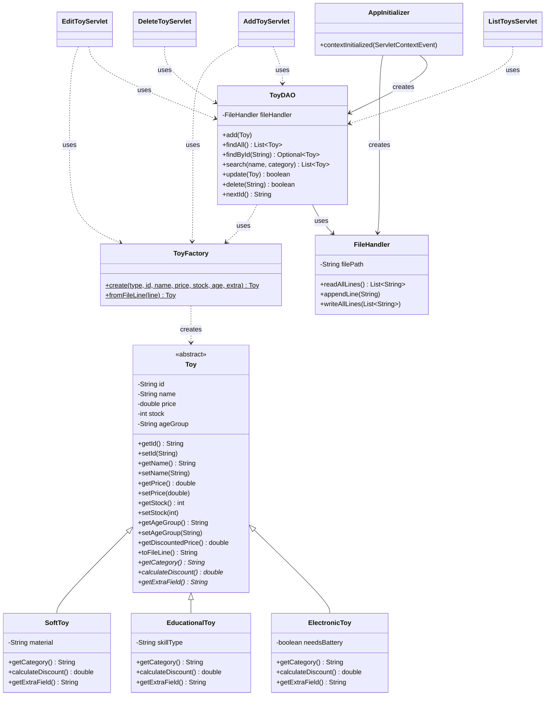

# Class Diagram — Toy Management Component

## Overview

The component is organised into four packages, each with one job:

| Package | Responsibility |
|---|---|
| `com.toystore.model` | Domain classes — `Toy` and its subclasses |
| `com.toystore.dao` | Data Access Object — CRUD operations |
| `com.toystore.util` | File I/O helpers and the startup listener |
| `com.toystore.servlet` | HTTP entry points (one per CRUD action) |

---

## UML Class Diagram (Mermaid)



---

## Plain Text Hierarchy

```
                       ┌─────────────────┐
                       │  Toy (abstract) │
                       │─────────────────│
                       │ - id            │
                       │ - name          │
                       │ - price         │
                       │ - stock         │
                       │ - ageGroup      │
                       │─────────────────│
                       │ + getters/setters│
                       │ + toFileLine()  │
                       │ # getCategory() │   ← abstract
                       │ # calculateDis… │   ← abstract
                       │ # getExtraField │   ← abstract
                       └────────┬────────┘
                                │
            ┌───────────────────┼───────────────────┐
            │                   │                   │
   ┌────────▼────────┐ ┌────────▼────────┐ ┌────────▼────────┐
   │ ElectronicToy   │ │ EducationalToy  │ │    SoftToy      │
   │─────────────────│ │─────────────────│ │─────────────────│
   │ - needsBattery  │ │ - skillType     │ │ - material      │
   │─────────────────│ │─────────────────│ │─────────────────│
   │ +getCategory()  │ │ +getCategory()  │ │ +getCategory()  │
   │ +calcDiscount() │ │ +calcDiscount() │ │ +calcDiscount() │
   │   = price * .10 │ │   = price * .15 │ │   = price * .05 │
   └─────────────────┘ └─────────────────┘ └─────────────────┘
```

## Layered Architecture

```
                 [ JSP Views ]
       index.jsp · add-toy.jsp · toy-list.jsp · edit-toy.jsp
                       │
                       ▼
                 [ Servlets ]
   AddToy · ListToys · EditToy · DeleteToy   (HTTP entry points)
                       │
                       ▼
                 [ DAO Layer ]
                    ToyDAO            (CRUD logic)
                       │
                       ▼
                 [ Util Layer ]
            FileHandler · ToyFactory  (I/O + parsing)
                       │
                       ▼
              WEB-INF/data/toys.txt
```
